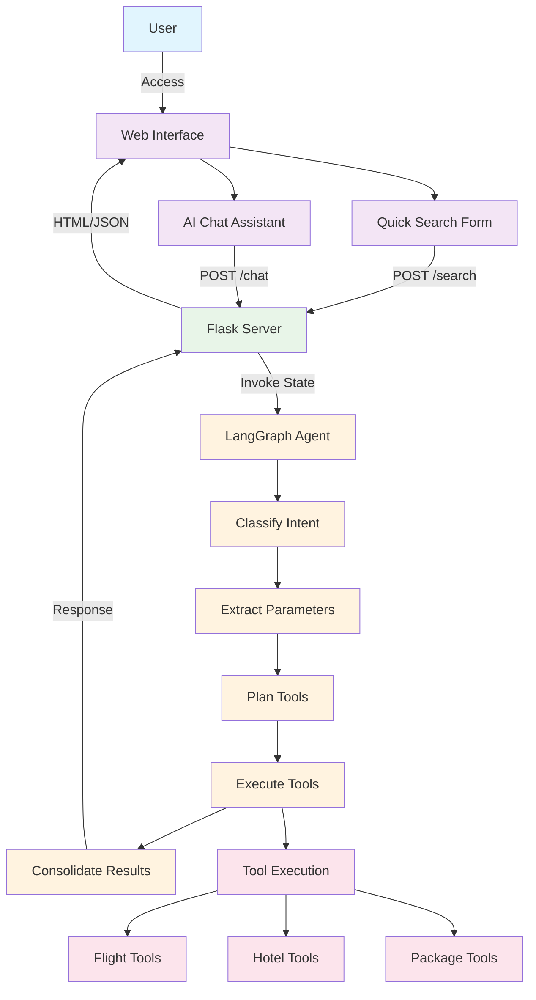
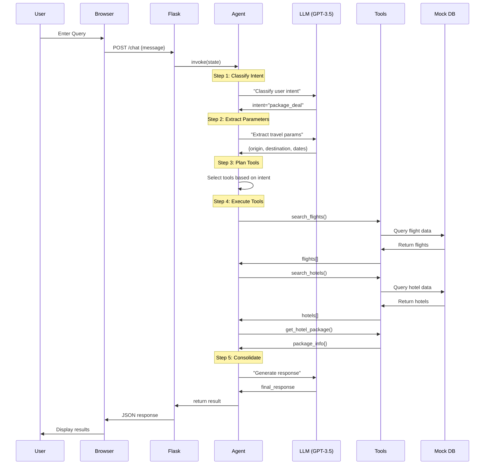
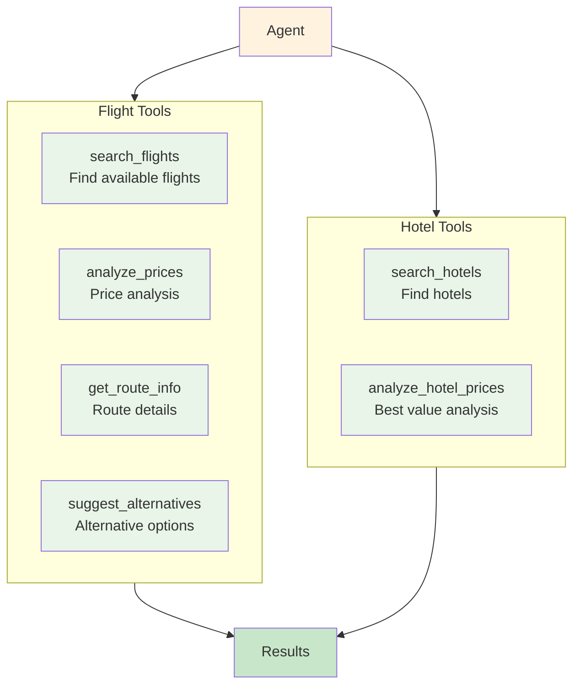
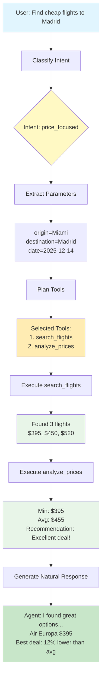
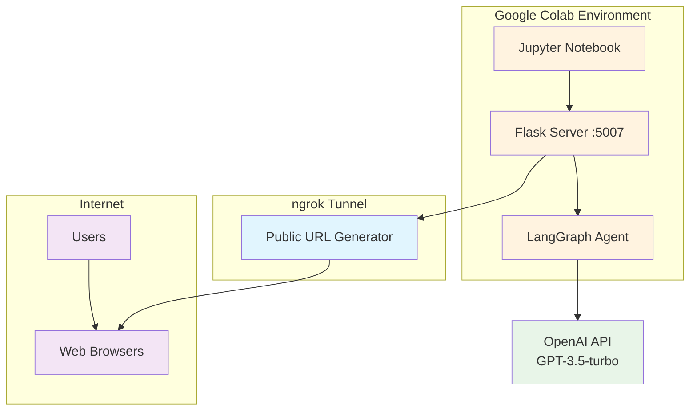
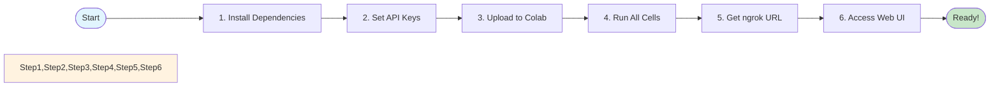

# Payanam_AI Travel Agent

An intelligent travel booking assistant powered by GPT-3.5-turbo and LangGraph that helps users search for flights, hotels, and complete travel packages through both a form-based interface and an AI chat assistant.

##  Features

- **Dual Interface**: Quick search form + AI chat assistant
- **Smart Intent Classification**: Automatically understands user queries
- **Package Deals**: Combines flights and hotels for better prices
- **Price Analysis**: Real-time price comparisons and recommendations
- **Alternative Suggestions**: Finds nearby airports and alternative dates to save money
- **NLP**: Chat naturally about your travel plans

## Tools Used

### Core Technologies
* **Python** - Backend logic and data processing
* **Flask** - Web application framework serving dual interface
* **OpenAI GPT-3.5-turbo** - Natural language understanding and response generation
* **LangChain** - Framework for building LLM applications
* **LangGraph** - Workflow orchestration for multi-step agent processes

## System Architecture



## Complete Request Flow



##  Agent Workflow (LangGraph)

```mermaid
graph LR
    Start([User Query]) --> Classify[1. Classify Intent]
    Classify --> Extract[2. Extract Parameters]
    Extract --> Plan[3. Plan Tools]
    Plan --> Execute[4. Execute Tools]
    Execute --> Consolidate[5. Consolidate Results]
    Consolidate --> End([Final Response])
    
    style Start fill:#e1f5fe
    style End fill:#c8e6c9
    style Classify fill:#fff9c4
    style Extract fill:#ffecb3
    style Plan fill:#ffe0b2
    style Execute fill:#ffccbc
    style Consolidate fill:#d1c4e9
```



## Tool Architecture



## Chat Flow Example



##  Deployment Architecture



##  Quick Start Flow


## Installation

### Prerequisites
- Python 3.8+
- OpenAI API Key
- ngrok account (for public URL)

### Step 1: Install Dependencies
```bash
pip install openai langchain-openai langgraph Flask pyngrok
```

### Step 2: Set API Keys
```python
# OpenAI API Key
OPENAI_API_KEY = "your-openai-api-key"
os.environ['OPENAI_API_KEY'] = OPENAI_API_KEY

# ngrok auth token (for public access)
!ngrok authtoken your-ngrok-token
```

### Step 3: Run the Application

**In Google Colab:**
1. Upload the notebook
2. Run all cells sequentially
3. The final cell will generate a public ngrok URL
4. Access the app through that URL

**Local Development:**
```python
# Run Flask locally
python app.py
# Then visit http://localhost:5007
```

### LLM Configuration
- **Model**: GPT-3.5-turbo
- **Temperature**: 0 (deterministic responses)
- **Provider**: OpenAI via LangChain

### Limitations
- Mock data only (no real flight/hotel APIs)
- Limited to pre-configured routes
- ngrok free tier has connection limits
- No persistent storage
- No user authentication

## 📄 License

This is a demonstration project for educational purposes.

---

