# Payanam_AI Travel Agent

An intelligent travel booking assistant powered by GPT-3.5-turbo and LangGraph that helps users search for flights, hotels, and complete travel packages through both a form-based interface and an AI chat assistant.

## System Architecture


## Complete Request Flow


## 🎯 Agent Workflow (LangGraph)


## 🧠 Intent Classification System


## 🛠️ Tool Architecture


## 💬 Chat Flow Example


## 🌐 Deployment Architecture

```mermaid
graph TB
    subgraph Colab[☁️ Google Colab Environment]
        Notebook[📓 Jupyter Notebook]
        Flask[🔥 Flask Server :5007]
        Agent[🤖 LangGraph Agent]
        
        Notebook --> Flask
        Flask --> Agent
    end
    
    subgraph ngrok[🚇 ngrok Tunnel]
        Tunnel[Public URL Generator]
    end
    
    subgraph Internet[🌍 Internet]
        Users[👥 Users]
        Browser[🌐 Web Browsers]
    end
    
    Flask --> Tunnel
    Tunnel --> Browser
    Users --> Browser
    
    Agent --> OpenAI[🧠 OpenAI API<br/>GPT-3.5-turbo]
    
    classDef colab fill:#fff3e0
    classDef tunnel fill:#e1f5fe
    classDef internet fill:#f3e5f5
    classDef external fill:#e8f5e8
    
    class Notebook,Flask,Agent colab
    class Tunnel tunnel
    class Users,Browser internet
    class OpenAI external
```



## 📡 API Endpoint Flow

```mermaid
graph LR
    subgraph Endpoints[🔌 Flask Endpoints]
        E1[GET /<br/>Home Page]
        E2[POST /search<br/>Form Handler]
        E3[POST /chat<br/>Chat Handler]
        E4[GET /health<br/>Health Check]
    end
    
    subgraph Processing[⚙️ Processing]
        P1[Parse Request]
        P2[Create State]
        P3[Invoke Agent]
        P4[Generate Response]
    end
    
    subgraph Response[📤 Response]
        R1[HTML Page]
        R2[JSON Data]
    end
    
    E1 --> R1
    E2 --> P1
    E3 --> P1
    E4 --> R2
    
    P1 --> P2
    P2 --> P3
    P3 --> P4
    P4 --> R1
    P4 --> R2
    
    classDef endpoints fill:#e1f5fe
    classDef processing fill:#fff3e0
    classDef response fill:#c8e6c9
    
    class E1,E2,E3,E4 endpoints
    class P1,P2,P3,P4 processing
    class R1,R2 response
```



## 🐛 Troubleshooting Flow

```mermaid
graph TD
    Problem[🐛 Issue Detected] --> Type{Issue Type?}
    
    Type -->|API Key| K1[Check Key Valid]
    Type -->|Port| P1[Change Port Number]
    Type -->|ngrok| N1[Check Free Tier Limits]
    Type -->|Agent| A1[Check Flask Status]
    
    K1 --> K2{Valid?}
    K2 -->|No| K3[Revoke & Regenerate]
    K2 -->|Yes| K4[Check Billing Enabled]
    
    P1 --> P2[PORT = 5008]
    
    N1 --> N2{Limit Reached?}
    N2 -->|Yes| N3[Wait or Upgrade]
    N2 -->|No| N4[Restart Tunnel]
    
    A1 --> A2[Verify State Dict]
    A2 --> A3[Check Console Logs]
    
    K3 --> Solved[✅ Resolved]
    K4 --> Solved
    P2 --> Solved
    N3 --> Solved
    N4 --> Solved
    A3 --> Solved
    
    style Problem fill:#ffebee
    style Type fill:#fff9c4
    style Solved fill:#c8e6c9
```



## 🚀 Quick Start Flow

```mermaid
graph LR
    Start([Start]) --> Step1[1. Install Dependencies]
    Step1 --> Step2[2. Set API Keys]
    Step2 --> Step3[3. Upload to Colab]
    Step3 --> Step4[4. Run All Cells]
    Step4 --> Step5[5. Get ngrok URL]
    Step5 --> Step6[6. Access Web UI]
    Step6 --> End([Ready! 🎉])
    
    style Start fill:#e1f5fe
    style End fill:#c8e6c9
    style Step1,Step2,Step3,Step4,Step5,Step6 fill:#fff3e0
```



## ✨ Features

- **Dual Interface**: Quick search form + AI chat assistant
- **Smart Intent Classification**: Automatically understands user queries
- **Multi-Tool Agent**: Uses 7 specialized tools for comprehensive travel planning
- **Package Deals**: Combines flights and hotels for better prices
- **Price Analysis**: Real-time price comparisons and recommendations
- **Alternative Suggestions**: Finds nearby airports and alternative dates to save money
- **Natural Language Processing**: Chat naturally about your travel plans

## 🚀 Installation

### Prerequisites
- Python 3.8+
- OpenAI API Key
- ngrok account (for public URL)

### Step 1: Install Dependencies
```bash
pip install openai langchain-openai langgraph Flask pyngrok
```

### Step 2: Set API Keys
```python
# OpenAI API Key
OPENAI_API_KEY = "your-openai-api-key"
os.environ['OPENAI_API_KEY'] = OPENAI_API_KEY

# ngrok auth token (for public access)
!ngrok authtoken your-ngrok-token
```

### Step 3: Run the Application

**In Google Colab:**
1. Upload the notebook
2. Run all cells sequentially
3. The final cell will generate a public ngrok URL
4. Access the app through that URL

**Local Development:**
```python
# Run Flask locally
python app.py
# Then visit http://localhost:5007
```

## 📋 Usage Examples

### Quick Search Form
- Fill in origin, destination, dates, and passengers
- Click "Search Trips" for comprehensive results

### AI Chat Assistant
**Example queries:**
- "Find cheap flights to Madrid"
- "I need hotels in London for 3 nights"
- "Book me flights and hotel to Paris for 2 people"
- "What are alternative airports near New York?"
- "Compare prices for flights to Madrid"

## ⚙️ Configuration

### Supported Routes
- Miami ↔ Madrid
- New York ↔ London

### Default Values
```python
{
    "origin": "Miami",
    "destination": "Madrid",
    "date": "2025-12-14",
    "passengers": 1,
    "check_in": "2025-12-14",
    "check_out": "2025-12-17",
    "guests": 2
}
```

## 🔧 Technical Details

### State Management
```python
class TravelAgentState(TypedDict):
    query: str                      # User input
    intent: str                     # Classified intent
    extracted_params: Dict          # Travel parameters
    tools_used: List[str]           # Tools executed
    flights: List[Dict]             # Flight results
    hotels: List[Dict]              # Hotel results
    package_info: Dict              # Package details
    final_response: str             # AI response
    messages: List[str]             # Conversation log
```

### LLM Configuration
- **Model**: GPT-3.5-turbo
- **Temperature**: 0 (deterministic responses)
- **Provider**: OpenAI via LangChain

### Flask Endpoints
- `GET /` - Home page with dual interface
- `POST /search` - Process form submissions
- `POST /chat` - Handle chat messages (returns JSON)
- `GET /health` - Health check endpoint

## ⚠️ Important Notes

### Security Warning
**⚠️ CRITICAL**: The notebook contains an exposed OpenAI API key!

**Immediate actions required:**
1. Revoke the exposed API key from OpenAI dashboard
2. Generate a new key
3. Use environment variables: `OPENAI_API_KEY = os.getenv('OPENAI_API_KEY')`

### Limitations
- Mock data only (no real flight/hotel APIs)
- Limited to pre-configured routes
- ngrok free tier has connection limits
- No persistent storage
- No user authentication

## 🛠️ Troubleshooting

**"API Key Invalid" Error**
- Verify key is correctly set
- Check if key hasn't been revoked
- Ensure billing is enabled on OpenAI account

**"Port Already in Use"**
```python
PORT = 5008  # Change to different port
```

**ngrok Connection Issues**
- Free tier has limits (40 connections/minute)
- Tunnel expires after 2 hours
- May need to restart for new URL

## 📝 Sample Test Queries

1. "Find flights from Miami to Madrid"
2. "I need the cheapest hotel in London"
3. "Book everything for a trip to Paris next month"
4. "What are alternatives to flying into Madrid?"
5. "Compare hotel prices in Madrid"
6. "I want a complete package to New York for 2 people"

## 🤝 Contributing

**Ways to extend:**
- Add more tools to `FlightTools` class
- Integrate real travel APIs (Amadeus, Skyscanner)
- Improve UI/UX design
- Add more intent types
- Implement user preferences and history

## 📄 License

This is a demonstration project for educational purposes.

## 🔗 Resources

- [LangGraph Documentation](https://langchain-ai.github.io/langgraph/)
- [OpenAI API Docs](https://platform.openai.com/docs)
- [Flask Documentation](https://flask.palletsprojects.com/)
- [ngrok Documentation](https://ngrok.com/docs)

---

**Built with**: OpenAI GPT-3.5, LangGraph, LangChain, Flask, ngrok
